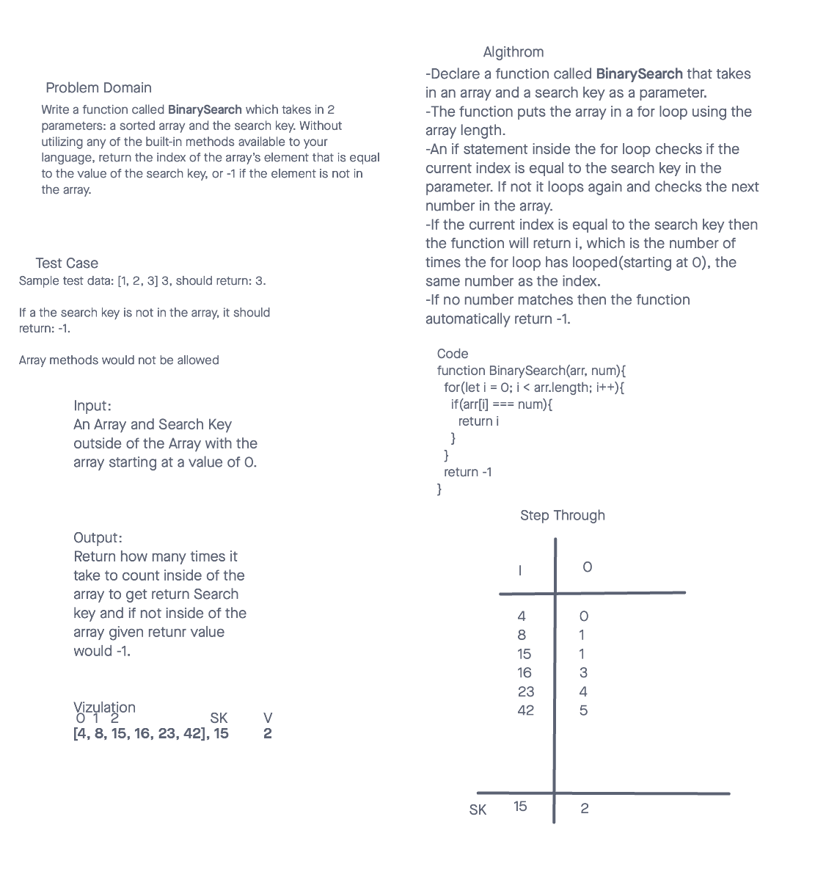

# Array-Binary-Search

## Challenge Title

Write a function called BinarySearch which takes in 2 parameters: a sorted array and the search key. Without utilizing any of the built-in methods available to your language, return the index of the array’s element that is equal to the value of the search key, or -1 if the element is not in the array.

## Whiteboard Process

## Approach & Efficiency

Input:
An Array and Search Key outside of the Array with the array starting at a value of 0.

Output:
Return how many times it take to count inside of the array to get return Search key and if not inside of the array given return value would -1.

## Solution

- Code
<!-- function BinarySearch(arr, num){
  for(let i = 0; i < arr.length; i++){
    if(arr[i] === num){
      return i
    }
  }
  return -1
} -->

### Collaborators

Worked with Emanuel Gonzales
