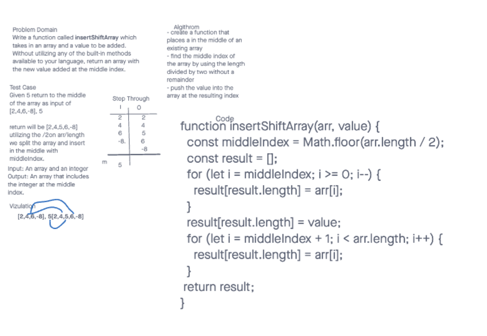

# Array-Reverse

# Challenge Title

Write a function called insertShiftArray which takes in an array and a value to be added. Without utilizing any of the built-in methods available to your language, return an array with the new value added at the middle index.

## Whiteboard Process

## Approach & Efficiency

Input: An array and an integer
Output: An array that includes
the integer at the middle
index.

## Solution

- Code
<!--
function insertShiftArray(arr, value) {
  const middleIndex = Math.floor(arr.length / 2);
  const result = [];
  for (let i = middleIndex; i >= 0; i--) {
    result[result.length] = arr[i];
  }
  result[result.length] = value;
  for (let i = middleIndex + 1; i < arr.length; i++) {
    result[result.length] = arr[i];
  }
 return result;
}  -->
### Collaborators

Worked with Katherine Lee 
