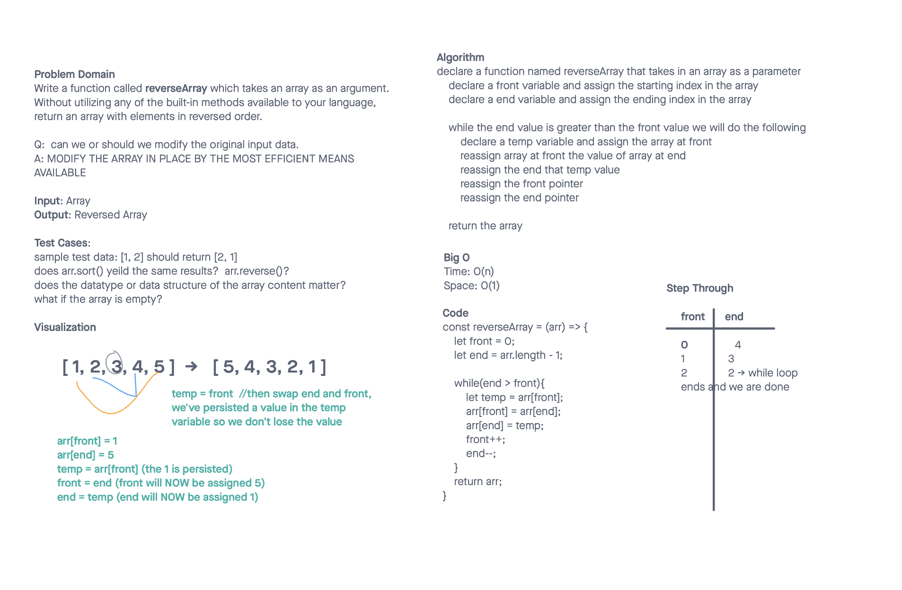

# Array-Reverse

# Challenge Title

Write a function called `reverseArray` which takes an array as an argument. Without utilizing any of the built-in methods available to your language, return an array with elements in reversed order.

## Whiteboard Process

## Approach & Efficiency

Modified array in place to yield a time efficiency of 0(n) and a space efficiency of 0(1).

## Solution

- Code
<!-- const reverseArray = (arr) => {
	let front = 0;
	let end = arr.length - 1;

	while(end > front){
		let temp = arr[front];
		arr[front] = arr[end];
		arr[end] = temp;
		front++;
		end--;
	}
	return arr;
} -->

### Collaborators

Forked Repo from Ryan Gallaway with permission as review done by class.

401d53 and 401d10
