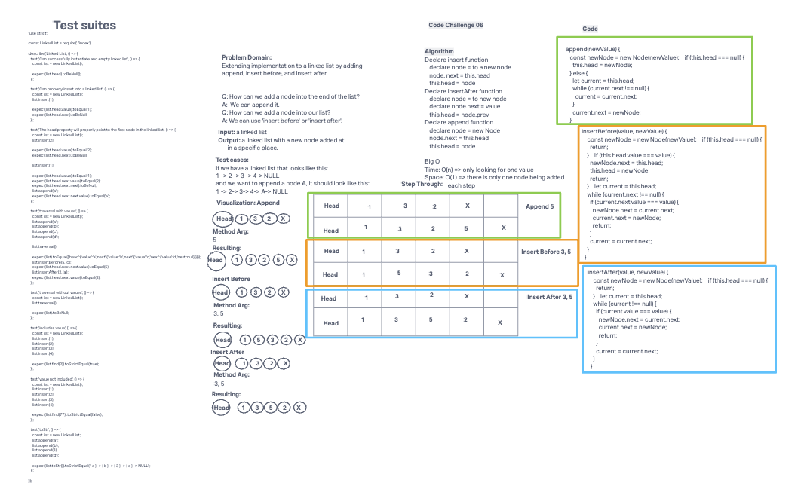

# Array-Reverse

# Challenge Title

Extending implementation to a linked list by adding append, insert before, and insert after.

## Whiteboard Process

## Approach & Efficiency

Input: a linked list

Output: a linked list with a new node added at
in a specific place.

## Solution

<!--
'use strict';

class Node {
  constructor(value) {
    this.value = value;
    this.next = null;
  }
}

class LinkedList {
  constructor() {
    this.head = null;
  }

  insert(value) {
    const node = new Node(value);
    node.next = this.head;
    this.head = node;
  }

  insertBefore(value, target) {
    const node = new Node(value);

    if (!this.head || this.head.value === target) {
      node.next = this.head;
      this.head = node;
      return;
    }

    let currentNode = this.head;
    while (currentNode.next) {
      if (currentNode.next.value === target) {
        node.next = currentNode.next;
        currentNode.next = node;
        return;
      }
      currentNode = currentNode.next;
    }
    currentNode.next = node;
  }

  insertAfter(value, target) {
    const node = new Node(value);

    if (!this.head) {
      this.head = node;
      return;
    }

    let currentNode = this.head;
    while (currentNode) {
      if (currentNode.value === target) {
        node.next = currentNode.next;
        currentNode.next = node;
        return;
      }
      currentNode = currentNode.next;
    }
    currentNode = node;
  }

  append(value) {
    const node = new Node(value);

    if (!this.head) {
      this.head = node;
      return;
    }

    let currentNode = this.head;
    while (currentNode.next) {
      currentNode = currentNode.next;
    }
    currentNode.next = node;
  }

  traverse() {
    let current = this.head;
    while (current) {
      console.log(current.value);
      current = current.next;
    }
  }

  find(value) {
    let current = this.head;
    while (current) {
      if (current.value === value) return true;
      current = current.next;
    }
    return false;
  }

  toString() {
    let result = '';
    let current = this.head;

    while (current) {
      result += `{ ${current.value} } -> `;
      current = current.next;
    }
    result += 'NULL';

    return result;
  }
}

module.exports = LinkedList; -->

### Collaborators

Worked with Class401D95
