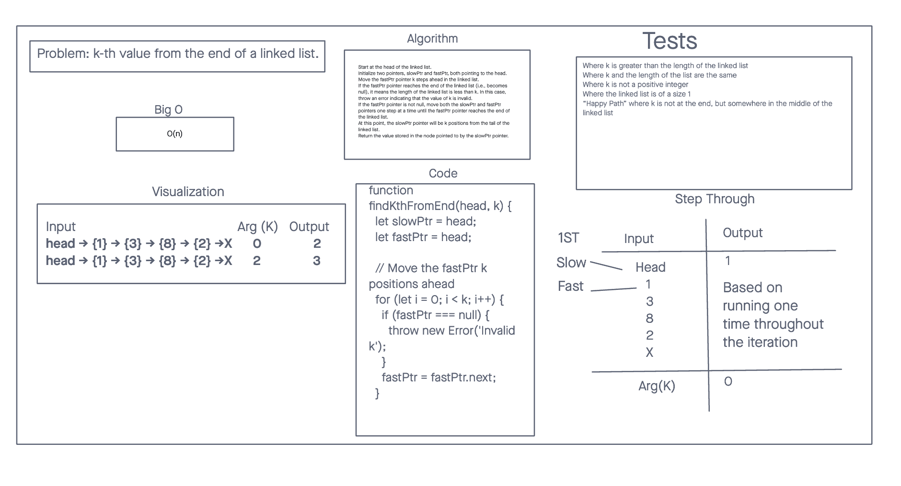

# Linked-List-KTH

## Challenge Title
k-th value from the end of a linked list.

## Whiteboard Process

## Approach & Efficiency

Input:
An Array and Search Key outside of the Array with the array starting at a value of 0.

Output:
Return how many times it take to count inside of the array to get return Search key and if not inside of the array given return value would -1.

## Solution

- Code
 <!-- class Node {
  constructor(value, next = null) {
    this.value = value;
    this.next = next;
  }
}

class LinkedList {
  constructor() {
    this.head = null;
  }

  kthFromEnd(k) {
    if (!this.head) {
      throw new Error('Linked List is empty.');
    }

    let slow = this.head;
    let fast = this.head;

    // Move the fast pointer k nodes ahead of the slow pointer
    for (let i = 0; i < k; i++) {
      if (fast.next) {
        fast = fast.next;
      } else {
        throw new Error(`Invalid value of k: ${k}. The list has fewer than k nodes.`);
      }
    }

    // Move both slow and fast pointers until fast reaches the end of the list
    while (fast.next) {
      slow = slow.next;
      fast = fast.next;
    }

    // The slow pointer is now k nodes from the tail
    return slow.value;
  }
} -->

### Collaborators

Worked with Kenya Womack and Kaeden O' Meara
